Univerza v Ljubljani
Fakulteta za računalništvo in informatiko 10em

Miha Zidar

****Dostop do podatkov Svetovne banke v orodju Orange

2em DIPLOMSKO DELO
UNIVERZITETNI ŠTUDIJSKI PROGRAM RAČUNALNIŠTVO IN INFORMATIKA

Mentor: prof. dr. Blaž Zupan

2em Ljubljana, 2016

*Besedilo je oblikovano z urejevalnikom besedil LaTeX.*

Namesto te strani **vstavite** original izdane teme diplomskega dela s podpisom mentorja in dekana ter žigom fakultete, ki ga diplomant dvigne v študentskem referatu, preden odda izdelek v vezavo!

**Izjava o avtorstvu diplomskega dela**

Spodaj podpisani Miha Zidar, z vpisno številko **63060317**, sem avtor diplomskega dela z naslovom:

*Dostop do podatkov Svetovne banke v orodju Orange*

S svojim podpisom zagotavljam, da:

-   sem diplomsko delo izdelal samostojno pod mentorstvom prof. dr. Blaža Zupana,

-   so elektronska oblika diplomskega dela, naslov (slov., angl.), povzetek (slov., angl.) ter ključne besede (slov., angl.) identični s tiskano obliko diplomskega dela

-   soglašam z javno objavo elektronske oblike diplomskega dela v zbirki “Dela FRI”.

V Ljubljani, dne Podpis avtorja:

*Zahvalil bi se mentorju, prof. dr. Blažu Zupanu in članom laboratorija za bioinformatiko za pomoč in usmerjanje med izdelavo diplomskega dela. Prav tako bi se zahvalil svojemu partnerju, staršem in prijateljem za spodbudo.*

0.55

Povzetek
========

**Naslov:** Dostop do podatkov Svetovne banke v orodju Orange

 
**Avtor:** Miha Zidar

 
Program Orange je orodje za podatkovno rudarjenje, v katerem lahko za namene analiz uporabimo različne podatkovne vire. Sam program Orange vsebuje predpripravljene zbirke podatkov, dodatne zbirke podatkov si lahko pripravi in uvozi tudi uporabnik sam, ali pa uporabi katerega od že obstoječih dodatkov za uvoz podatkov. Za namen diplomske naloge smo izdelali dodatek Orange data sets, s katerim je mogoče dostopati do podatkov s programskega vmesnika Svetovne banke. Trenutno Svetovna banka omogoča uporabo štirih različnih programskih vmesnikov: gospodarski indikatorji, finančni podatki, projekti Svetovne banke in podnebni podatki. Dodatek Orange data sets vsebuje dva gradnika, ki sta namenjena lažjemu branju in uporabi podatkov indikatorjev in podnebnih podatkov. S tem bo uporabnikom programa Orange omogočena enostavnejša uporaba velikega števila podatkov iz omenjenih dveh programskih vmesnikov.

 
**Ključne besede:** Podatkovno rudarjenje, programski vmesnik, Svetovna banka, gospodarski indikatorji, podnebni podatki, Orange.

Abstract
========

**Title:** Access to World bank data with Orange

 
**Author:** Miha Zidar

 
TODO: Orange is an open source data-mining software, capable of using multiple sources for data analysis. There are a few test data sample already present in Orange, and the user can import their own data sets with the use of one of Orange input widgets. For this thesis we created a new widget “Orange data sets” for accessing free data from World bank application program interface (API). The World bank exposes four different data APIs; indicator, project, finance and climate. Our Orange data sets widget will be able to read data from the indicators and climate APIs.

 
**Key words:** Data mining, API, World bank, indicators, climate, Orange.

Uvod
====

Na svetovnem spletu je dosegljivih vedno več prosto dostopnih programskih vmesnikov (*angl.* application programming interface). Ti vmesniki omogočajo dostop do zelo raznolikih zbirk podatkov. Nekaj primerov prosto dostopnih podatkovnih zbirk je seznam stopnje ogroženosti živali po državah  [1], podatki meritev in slike vesolja agencije NASA  [2], seznam knjig z ocenami in povezavami med uporabniki  [3], zgodovina meteoroloških meritev  [4], razni indikatorji stopenj razvoja držav  [5].

Programski vmesniki so oblikovani tako, da je omogočena raznolika uporaba podatkov iz podatkovnih zbirk. To pa ima tudi slabost, ki je v tem, da je podatke potrebno predhodno obdelati za vsak namen posebej. Tako bi na primer moral vsak uporabnik programa Orange podatke predhodno pretvoriti v obliko, primerno za njegovo konkretno analizo.

Motivacija
----------

Povezava programskega vmesnika za dostop do podatkov in orodja za analizo podatkov je pogosto prezapletena za končnega uporabnika. Razviti želimo knjižnice in dodatke za program Orange s katerimi bi podatke s programskega vmesnika Svetovne banke spravili v obliko, primerno za nadaljnjo uporabo v orodju Orange in drugih programih za obdelavo podatkov. S tem bi dobili enostavnejši dostop do preko 16.000 indikatorjev in številnih podnebnih meritev, s čimer bomo lažje analizirali in iskali morebitne zakonitosti v podatkih. Če bi imeli en sam ustrezen dodatek za dostop do podatkov programskega vmesnika Svetovne banke, bi se poenostavilo tudi posodabljanje in vzdrževanje kode v primeru sprememb programskega vmesnika. S tem odpravimo potrebo, da bi moral vsak uporabnik sam skrbeti za uskladitvene posodobitve, ampak se vmesnik posodobi enkrat in za vse uporabnike.

Cilji in struktura diplomske naloge
-----------------------------------

Cilj diplomske naloge je izdelati knjižnico za uporabo programskega vmesnika Svetovne banke ter izdelati dodatek za program Orange, ki s pomočjo omenjene knjižnice omogoča uporabniku dostop do podatkov Svetovne banke preko grafičnega vmesnika.

V diplomski nalogi najprej predstavimo spletna vira indikatorjev držav sveta in meritev podnebnih podatkov Svetovne banke, ter opišemo delovanje njunih programskih vmesnikov. Nato podrobneje opišemo našo implementacijo knjižnice za dostop do programskega vmesnika Svetovne banke in gradnikov za program Orange, ki to knjižnico uporabljajo. V nadaljevanju prikažemo še nekaj praktičnih primerov uporabe dodatka Orange data sets. Na koncu še popišemo opravljeno delo, navedemo vire kode in omenimo možne načine za izboljšavo ali nadgradnjo našega dodatka.

Podatkovne zbirke Svetovne Banke
================================

Pri diplomski nalogi smo se osredotočili na dva programska vmesnika za dostop podatkov Svetovne banke, to sta “ClimateAPI” s katerim dostopamo do podatkovne zbirke meteoroloških meritev in “IndicatorAPI” s katerim dostopamo do zbirke podatkov raznih indikatorjev stopenj razvoja držav. Za uporabo podatkovne zbirke Svetovne banke smo se odločili, ker združuje in na enovit način predstavi podatke iz več različnih virov. Podatkovni viri za indikatorje stopnje razvoja držav so:

-   Svetovni indikatorji razvoja 

-   Globalni finančni razvoj 

-   Afriški indikatorji razvoja 

-   Poslovanje ,

-   Podjetniške raziskave ,

-   Razvojni cilji ,

-   Statistike izobraževanja ,

-   Statistike spolov ,

-   Statistike zdravja in prehranjevanja ,

-   Rezultati meritev IDA .

Podatkovni vir zbirke podnebnih meritev pa je osnovan na podatkih oddelka za podnebne raziskave (*angl.* Climatic Research Unit) .

Svetovna banka omogoča dostop do podatkov preko programskega vmesnika predstavitvene arhitekture za prenos podatkov REST (*angl.* Representational State Transfer), ki ponuja veliko možnosti za iskanje in presejanje rezultatov. Pri vsaki poizvedbi REST lahko določimo želeno obliko odgovora. Za poizvedbe o informacijah indikatorjev sta na voljo obliki razširljivega označevalnenga jezika XML (*angl.* Extensible Markup Language) in javascript objektne notacije JSON (*angl.* JavaScript Object Notation). Programski vmesnik meteoroloških meritev pa ponuja samo obliko JSON. Za konsistentnost in lažjo berljivost smo na obeh programskih vmesnikih uporabili obliko JSON. To na programskem vmesniku indikatorjev dosežemo tako da nastavimo parameter GET `format` na vrednost `json`.

Podatki indikatorjev razvoja držav
----------------------------------

Programski vmesnik indikatorjev razvoja držav Svetovne banke omogoča dostop do podatkov preko 16.000 raznih indikatorjev. Podatki indikatorjev so merjeni v mesečnem, četrtletnem ali letnem intervalu. Začetek meritev podatkov posameznega indikatorja je odvisna od vira podatkov. Najstarejši podatki segajo do leta 1960. Poleg podatkov indikatorjev nam ta programski vmesnik omogoča tudi dostop do večine metapodatkov, s katerimi lahko presejamo in natančneje določimo našo poizvedbo. Seznami metapodatkov so:

-   viri podatkov in njihovi opisi (*angl.* Catalog Source Queries)  [6]),

-   seznam držav, skupin držav in regij z identifikatorji (*angl.* Country Queries)  [7]),

-   razdelitev višin dohodkov z identifikatorji (*angl.* Income Level Queries)  [8]),

-   seznam indikatorjev (*angl.* Indicator Queries)  [9]),

-   seznam tipov posojil (*angl.* Lending Type Queries)  [10]),

-   seznam tem (*angl.* Topics  [11]).

Za pridobitev podatkov indikatorjev potrebujemo metapodatke o indikatorjih in državah. Primere teh metapodatkov si bomo podrobneje pogledali v nadaljevanju.

Ker je mogoče z eno poizvedbo dostopati do velike količine podatkov, ima programski vmesnik za dostop do podatkov indikatorjev implementirano ostranjevanje, s katerim je omejeno število podatkov, ki jih lahko dobimo z eno poizvedbo. Tako so podatki razdeljeni na skupine ki jih imenujemo strani.

Vsi odgovori na veljavne poizvedbe po podatkih in metapodatkih, ki so na voljo s programskim vmesnikom indikatorjev razvoja, imajo enako osnovno obliko. Poizvedbe vračajo seznam z dvema elementoma, kjer ima prvi element informacije o količini podatkov in trenutnem izboru podatkov, drugi element pa vsebuje seznam izbranih podatkov (Primer \[basic\_response\]). Privzeta vrednost števila elementov na stran je 50, kar lahko spremenimo tako, da poizvedbi nastavimo parameter GET `per_page` na poljubno vrednost. Če želimo pridobiti podatke z več strani, moramo za vsako stran poslati novo poizvedbo, v kateri podamo želeno stran s parametrom GET `page`, . Veljavne poizvedbe, s sitom ki ne vrača nobenih podatkov, imajo vrednost drugega elementa osnovnega seznama `null`. Za neveljavne poizvedbe pa programski vmesnik vrača seznam z enim elementom, ki vsebuje podatke o napaki poizvedbe (Primer \[error\_response\]).

    [
        {
            'page': 1,
            'pages': 137,
            'per_page': '50',
            'total': 6831
        },
        [
            <podatki>,
            ...
        ]
    ]

    [
        {
            'message': [
                {
                    'id': '120',
                    'key': 'Parameter \'country\' has an invalid value',
                    'value': 'The provided parameter value is not valid'
                }
            ]
        }
    ]

### Opis seznama indikatorjev

Programski vmesnik Svetovne banke za indikatorje razvoja nam ponuja seznam vseh indikatorjev z imeni, opisi, kodami in drugimi metapodatki (Primer \[indicator\_response\]). Programski vmesnik nam omogoča tudi dostop do podatkov posameznega indikatorja določenega s kodo in presejanje seznama indikatorjev glede na vir podatkov \[indicator\_queries\]. V našem programu smo uporabili le poizvedbo za celoten seznam indikatorjev, da smo omogočili iskanje in presejanje po vseh poljih indikatorjev.

    http://api.worldbank.org/indicators?format=json
    http://api.worldbank.org/indicators?format=json&source=5
    http://api.worldbank.org/indicators/A10i?format=json

    {
        'id': '1.0.HCount.2.5usd',
        'name': 'Poverty Headcount (\$2.50 a day)',
        'source': {
            'id': '37',
            'value': 'LAC Equity Lab'
        },
        'sourceNote': 'The poverty headcount index measures the 
                       proportion of the population with daily per 
                       capita income (in  2005 PPP) below the poverty
                       line.',
        'sourceOrganization': 'LAC Equity Lab tabulations of SEDLAC 
                               (CEDLAS and the World Bank).',
        'topics': [
            {
                'id': '11',
                'value': 'Poverty '
            }
        ]
    }

### Opis seznama držav

Seznam držav na programskem vmesniku Svetovne banke vsebuje podatke o imenih, opisih, ISO-3166-1 alpha kodah, regijah in druge metapodatke (Primer \[country\_response\]). Programski vmesnik nam omogoča tudi presejanje seznama držav po kodi države, regiji, višini dohodka in tipu posojil (Premer \[country\_queries\])

    http://api.worldbank.org/countries?format=json
    http://api.worldbank.org/countries/svn?format=json
    http://api.worldbank.org/countries?format=json&incomeLevel=HIC&region=ECS

Ta seznam ne vsebuje zgolj samo držav, ampak tudi regije in skupine držav, združenih glede na različne kriterije (višine dohodka, velikost, stopnja razvoja). Poleg tega zgornji seznam vsebuje tudi nekatere izjeme kot je trenutno Kosovo. V nadaljevanju bomo za vse naštete tipe lokacijskih podatkov uporabljali besedo “države”.

    {
        'id': 'ABW',
        'iso2Code': 'AW',
        'name': 'Aruba',
        'region': {
            'id': 'LCN',
            'value': 'Latin America & Caribbean '
        },
        'adminregion': {
            'id': '',
            'value': ''
        },
        'incomeLevel': {
            'id': 'HIC',
            'value': 'High income'
        },
        'lendingType': {
            'id': 'LNX',
            'value': 'Not classified'
        },
        'capitalCity': 'Oranjestad',
        'longitude': '-70.0167',
        'latitude': '12.5167'
    },

### Dostop do podatkov indikatorjev

Za dostop do podatkov posameznega indikatorja potrebujemo kodo indikatorja s seznama vseh indikatorjev in kodo ene ali več držav. Namesto kode ene ali več držav, lahko uporabimo tudi ključno besedo “all”, ki označuje vse kode držav. Pri večjih količinah podatkov lahko z dodatnimi parametri določimo število podatkov na stran, in želeno stran podatkov. Primer \[indicator\_dataset\_request\] prikazuje osnovno obliko poizvedbe, kjer so:

country  
s podpičjem ločen seznam kod izbranih držav, ki jih preberemo iz polja “id” ali “iso2Code”, ki sta prikazana v Primeru \[country\_response\], ali pa ključna beseda “all”,

indicator\_id  
polje “id” indikatorja ki je prikazano v Primeru \[indicator\_response\].

parametri  
Dodatni parametri GET

Za poizvedbe do podatkov indikatorjev so poleg osnovnih parametrov GET `per_page`, `page` in `format`, opisanih v poglavju \[sec:podatki\_ind\_razvoja\], na voljo tudi dodatni parametri za presejanje rezultatov poizvedbe:

MRV  
Številska vrednost, ki določi maksimalno število zadnjih meritev, ki jih programski vmesnik vrne. Ko uporabljamo polje `mrv` bo programski vmesnik izpustil ničelne vrednosti za obdobja v katerih ni meritev.

gapfill  
Zastavica `'y'` ali `'n'` za manjkajoče vrednosti meritev. Vrednost `'y'` kombinaciji s poljem `mrv` poskrbi da programski vmesnik ne izpusti nobenega časovnega intervala.

date  
Polje oblike `'leto'` ali `'leto:leto'` ki omeji rezultate poizvedbe na določeno leto ali interval med določenimi leti.

<!-- -->

    http://api.worldbank.org/en/countries/<country>/indicators/<indicator_id>?<parametri>

Privzeta vrednost za količino podatkov na stran `per_page` je 50. Zgornja meja pa ni strogo določena, vendar je odvisna od velikosti odgovora. Ugotovili smo, da se zanesljivost programskega vmesnika manjša z večjo količino podatkov na stran. V našem programu smo se omejili na 1000 podatkov na stran, kar se je izkazalo za uporabno razmerje med hitrostjo in zanesljivostjo programskega vmesnika. Privzeto bo programski vmesnik vrnil podatke za vse časovne vrednosti. V odgovoru API-ja dobimo seznam objektov (Primer \[dataset\_response\]) z datumom, indikatorjem, državo in vrednostjo.

    {
        'indicator': {
            'id': 'SP.POP.TOTL',
            'value': 'Population, total'
        },
        'country': {
            'id': 'IL',
            'value': 'Israel'
        },
        'value': '6289000',
        'decimal': '0',
        'date': '2000'
    }

Slabosti programskega vmesnika indikatorjev Svetovne banke za uporabo v namene podatkovnega rudarjenja so v tem, da vmesnik ni namenjen prenosu večje količine podatkov z eno samo poizvedbo. Zaradi ostranjevanja moramo za en sam indikator narediti več poizvedb, da prenesemo podatke z vseh strani. Prav tako podatkovni vmesnik ne podpira poizvedb po več indikatorjih hkrati, kar potrebujemo za iskanje zakonitosti med posameznimi indikatorji.

Podatki podnebnih meritev
-------------------------

Programski vmesnik Svetovne banke za podnebne podatke omogoča dostop do podatkov napovednih modelov in zgodovinskih meritev meteoroloških postaj. V tej diplomski nalogi smo se odločili uporabiti samo podatke zgodovinskih meritev, saj si s temi podatki lahko uporabnik programa Orange sam sestavi svoje napovedne modele.

Za razliko od uporabe programskega vmesnika indikatorjev, lahko pri tem programskem vmesniku uporabljamo veljavne ISO 3166-1 alpha-2 ali ISO 3166-1 alpha-3 kode držav, ali pa številski identifikator vodotočnega območja.

Ta programski vmesnik nam omogoča dostop do podatkov o povprečnih temperaturah in padavinah v časovnih obdobjih enega leta, desetletja ali pa nam omogoča dostop do mesečnih povprečij skozi vsa leta meritev.

### Dostop do podatkov podnebnih meritev

Za dostop do podnebnih podatkov preko programskega vmesnika Svetovne banke potrebujemo ISO-3166-1 alpha3 kodo države ali številski identifikator vodotočnega območja (Slika \[climate\_data\_api\_basins\]). Programski vmesnik nam omogoča dostop do meritev povprečnih količin padavin in temperatur za letno ali desetletno obdobje. Poleg letnega in desetletnega obdobja pa nam programski vmesnik ponuja tudi povprečno količino padavin in temperatur za posamezne mesece skozi vsa leta meritev. Obliko poizvedbe prikazuje primer \[climate\_dataset\_request\], kjer je:

loc\_type  
vrsta identifikatorja območja (“basin” za vodotočno območje, “country” za države),

data\_type  
vrsta meritev (“pr” za padavine, “tas” za temperature),

interval  
vrsta meritvenega obdobja (“month” za mesečno, “year” za letno in “decade” za desetletno),

location  
koda države ali številski identifikator vodotočnega območja.

Za razliko od programskega vmesnika indikatorjev, nam programski vmesnik podnebnih meritev z eno poizvedbo omogoča dostop do podatkov le za eno državo. To pomeni, da je količina podatkov dovolj omejena, da nam programski vmesnik vedno vrne vse podatke brez ostranjevanja, kot prikazuje primer \[climate\_dataset\_response\],

<embed src="pic/climate_data_api_basins.pdf" width="453" />

    http://climatedataapi.worldbank.org/climateweb/rest/v1/<loc_type>/cru/<data_type>/<interval>/<location>

    [
        {
            'month': 0,
            'data': 68.93643
        },
        {
            'month': 1,
            'data': 64.23069
        },
        {
            'month': 2,
            'data': 81.098724
        },
        ...
    ]

Težave pri uporabi programskih vmesnikov Svetovne banke
-------------------------------------------------------

Programski vmesniki Svetovne banke zajemajo podatke iz različnih virov, zato je težko zagotoviti pravilnost in konsistentnost podatkov. Poleg tega pa se programski vmesnik in spletna stran z dokumentacijo občasno spremenita, kar povzroča še dodatne težave pri uporabi. Nekatere težave, ki smo jih opazili so:

-   nekaterim delom dokumentacije se je med izdelavo te diplomske naloge spremenil spletni naslov, tako da do tistih delov sedaj nimamo več dostopa,

-   polje za datum v odgovoru je opisano, vendar ni dokumentirano, kakšne so vse možne vrednosti (nekaj primerov nedokumentiranih vrednosti: “last known value” “2001 - 2015” “2040”),

-   delovanje sita z različnimi kombinacijami polj `mrv`, `gapfill` in `date` ni ustrezno opisano,

-   v odgovoru poizvedbe po podatkih indikatorjev ponekod manjkajo vrednosti kot so koda države, ime države ali ime indikatorja.

-   zgornja meja števila izbranih lokacij na 250 ni navedena in napaka ki jo programski vmesnik vrne ni dokumentirana,

-   nemogoče je ugotoviti pogostost vzorčenja indikatorja (frequency), .

Knjižnica in gradniki za Orange
===============================

V okviru diplomske naloge smo razvili tri ločene komponente za programerje in končne uporabnike programa Orange. Prva komponenta je dostopna kot samostojni paket `simple_wbd` [12]. Druga in tretja komponenti pa sta združeni v paketu `orange3-datasets` [13]

Prva komponenta je programska knjižnica `simple_wbd`, ki omogoča enostaven dostop do programskega vmesnika indikatorjev in podnebnih podatkov Svetovne banke. Knjižnico smo implementirali z uporabo čim manjšega števila odvisnosti in je namenjena splošni uporabi v Python programih. Poudarka pri zasnovi knjižnice `simple_wbd` sta predvsem enostavnost razširitve in zanesljivost. Ta cilja dosežemo z mehanizmom za vključevanje lastne kode v komponente knjižnice in mehanizmi za popravljanje ali odstranjevanje pokvarjenih podatkov.

Drugi sestavni del je razširitev knjižnice `simple_wbd` s funkcionalnostmi, potrebnimi za lažje delo v programu Orange. To predvsem zavzema pretvorbo pridobljenih podatkov v podatkovno tabelo Orange in tabelo numpy. Ta sklop je namenjen skriptnemu delu s programom Orange in je dostopen kot `api_wrapper` Python modul znotraj paketa `orangecontrib.wbd`.

Tretji sestavni del je grafični vmesnik za uporabo `api_wrapper` modula. Namen grafičnega vmesnika je omogočiti laikom dostop do podatkov programskega vmesnika Svetovne banke znotraj programa Orange za namen obdelave, analize in iskanja zakonitosti v podatkih.

Knjižnica simple\_wbd
---------------------

Knjižnica `simple_wbd` programerjem olajša dostop do podatkov programskega vmesnika Svetovne banke. Glavni namen knjižnice je združevanje večjega števila zahtev po podatkih in enostavna predstavitev prejetih rezultatov. Te rezultate je nato iz več dimenzij možno pretvoriti v dvo-dimenzionalno polje, primerno za uporabo v programu Orange. Glavna razreda te knjižnice sta `IndicatorAPI` in `ClimateAPI`. Prvi omogoča pridobivanje podatkov iz programskega vmesnika indikatorjev, drugi pa s programskega vmesnika podnebnih meritev.

Čeprav za dostop do programskega vmesnika Svetovne banke že obstajajo rešitve kot sta knjižnici `wbdata` [14] in `wbpy` [15], smo se odločili za lastno implementacijo podobne knjižnice. Glavni razlog za to je, da obstoječe rešitve poskušajo čim bolj natančno predstaviti programski vmesnik Svetovne banke, ne pa olajšati dostop do čim večje količine podatkov.

Za potrebe te knjižnice smo razvili lastno rešitev za predpomnjenje poizvedb, saj so se bolj splošne rešitve, kot na primer `vcrpy` [16] in `requests-cache` [17], izkazale za prepočasne ko delamo z večjimi količinami podatkov. Naša rešitev za predpomnjenje izkorišča dejstvo da je vsaka poizvedba določena le z naslovom URL, in da so vsi odgovori oblike JSON. Za vsak URL naredimo novo datoteko v sistemskem začasnem imeniku, v kateri hranimo serializirane JSON podatke. Ker se podatki na programskem vmesniku Svetovne banke redko posodabljajo, smo za čas veljavnosti začasnih datotek izbrali en teden.

### Razred IndicatorAPI

`IndicatorAPI` je razred namenjen pridobivanju podatkov indikatorjev razvoja držav. Ker ima programski vmesnik Svetovne banke omejitev koliko podatkov lahko prenesemo z eno poizvedbo in nam dovoli tvoriti poizvedbe le za en indikator na enkrat, smo napisali razred, ki v ozadju tvori in izvede poizvedbe za vse strani vseh zahtevanih indikatorjev. To poskrbi tako da se po prvi poizvedbi za en indikator sprehodi čez število preostalih strani (Primer \[basic\_response\]), ki so na voljo, in pridobljene podatke več strani združi in predstavi kot rezultat ene same poizvedbe. Ta postopek ponovi za vse zahtevane indikatorje, in njihove rezultate vrne v obliki slovarja, ki ima za ključ kodo indikatorja posamezne zahteve.

Poleg tega da skrbi za prenos vseh strani podatkov, tudi beleži število izvedenih in število potrebnih poizvedb za celoten prenos. Ta števila se lahko uporablja za prikaz napredka prenosa podatkov.

Za namene razreda `IndicatorAPI` smo v knjižnici `simple_wbd` razvili mehanizme za odpravo nekaterih napak omenjenih v poglavju \[api\_gotchas\].

Pri manjkajočih vrednostih držav v poizvedbah za podatke indikatorjev, poskušamo določiti pravilne vrednosti. To naredimo s pomočjo dveh slovarjev: prvi slika kode držav v imena, drugi pa imena držav v kode. V primeru manjkajoče vrednosti kode ali imena, poskušamo to prebrati iz enega od naštetih slovarjev. Če nam ne uspe ugotoviti manjkajočih vrednosti, trenutni vnos odstranimo iz rezultata poizvedbe.

Drugi tip napak, ki ga lahko delno popravimo, so napačne vrednosti v polju `date` v poizvedbah za podatke indikatorjev. Ker lahko v temu polju pričakujemo poljubno besedilo, dela naš pretvornik za polje `date` v datum, tako da poskuša v datum pretvoriti čim daljšo predpono besedila. Če nam ne uspe besedila pretvoriti v veljaven datum, trenutni vnos odstranimo iz rezultata poizvedbe.

 
Glavne metode ki jih ponuja razred IndicatorAPI so:

get\_indicators  
za pridobivanje seznama indikatorjev s kodami, imeni in opisi,

get\_countries  
za pridobivanje seznama držav z metapodatki,

get\_dataset  
za pridobivanje instance razreda `IndicatorDataset`, ki vsebuje podatkov indikatorjev.

Ena izmed lastnosti razreda `IndicatorAPI` je, da mu lahko ob inicializaciji podamo razred v katerem želimo prejeti rezultat poizvedbe. Ta razred mora dedovati od osnovnega razreda `IndicatorDataset`. Na ta način lahko enostavno razširimo funkcionalnost `simple_wbd` knjižnice. V primeru \[indicator\_api\_extend\] vidimo en način za razširitev razreda `IndicatorDataset` tako da uporabniku razreda `MyIndicatorAPI` ni potrebno izrecno podati razreda `IndicatorDataset` v konstruktor.

    class MyIndicatorDataset(simple_wbd.IndicatorDataset):
        
        def as_numpy(self):
            raise NotImplemented()
        
        def as_orange_table(self):
            raise NotImplemented()

    class MyIndicatorAPI(simple_wbd.IndicatorAPI):

        def __init__(self):
            super().__init__(MyIndicatorDataset)

#### Razred IndicatorDataset

Razred `IndicatorDataset` je osnovni razred v katerem dobimo zahtevane podatke indikatorjev. Ta razred vsebuje vse potrebne metode in podatke za predstavitev rezultatov programskega vmesnika, na dva načina: kot slovar rezultatov poizvedb za posamezen indikator in dvo dimenzionalen seznam. Posamezna vrednost v teh podatkih je določena z državo, časovno komponento in kodo indikatorja.

Podatke lahko predstavimo kot dvodimenzionalno polje v dveh oblikah: kot časovne vrste ali kot podatki držav. Obliko predstavitve izberemo s parametrom `time_series` metode `as_list`. Za predstavitev obeh oblik je prva vrstica polja uporabljena kot naslovna vrstica, ki opisuje podatke v stolpcih.

Ko uporabljavo obliko časovnih vrst, so elementi prve vrstice kartezični produkt kod indikatorjev in držav. V prvem stolpcu polja pa imamo časovno komponento podatkov. Na ta način so vsi ostali elementi polja določeni s časovno komponento, državo in kodo indikatorja.

Ko dostopamo do dvodimezionalnega polja ki predstavlja podatke držav, pa je v prvi vrstici kartezični produkt kod indikatorjev in časovne komponente. Prvi stolpec v tej predstavitvi vsebuje imena držav. Za razliko od predstavitve v obliki časovnih vrst, v to polje vstavimo se dodatne stolpce ki vsebujejo metapodatke drzav iz primera \[country\_response\]: regija `region`, administrativna regija `adminregion`, višina dohodka `incomeLevel`, vrsta posojil `lendingType`, geografska širina `latitude`, geografska dolžina `longitude`. Tudi tukaj vsi ostali elementi določeni s časovno komponento, državo in kodo indikatorja.

### Razred ClimateAPI

Razred `ClimateAPI` olajša dostop do podnebnih podatkov programskega vmesnika Svetovne banke. Ta programski vmesnik dovoli poizvedbe po podatkih le ene vrste meritev za eno vrsto meritvenega obdobja in eno državo. Naš razred naredi kartezični produkt med vsemi zahtevanimi vrstami meritev, vrstami meritvenih obdobij in državami. Nato iz tega zgradi in izvede vse poizvedbe in predstavi podatke kot enotni odgovor. V razredu `ClimateAPI` hranimo tudi število vseh potrebnih poizvedb in število že izvedenih poizvedb, kar lahko uporabimo za prikaz napredka prenosa podatkov.

#### Razred ClimateDataset

Razred `ClimateDataset` je osnovni razred v katerem dobimo zahtevane podatke podnebnih meritev. Ta razred vsebuje vse potrebne metode in podatke za predstavitev rezultatov programskega vmesnika, na dva glavna načina: kot gnezden slovar in dvo dimenzionalen seznam. Posamezna vrednost v teh podatkih je določena z državo, vrsta podatkov, in časovno komponento. Poleg omenjenih načinov predstavitve podatkov lahko dostopamo tudi do neobdelanih podatkov prejetih iz programskega vmesnika za vsako poizvedbo posebej.

Časovno komponento rezultata sestavljata vrsta meritvenega obdobja in začetek obdobja meritve. Sestavljeno časovno komponento uporabljamo, da se izognemo dvoumnim primerom vrednosti začetka obdobja za letni in desetletni interval meritev. Primera takih dveh časovnih obdobij sta `'decade - 1990'` in `'year - 1990'`.

Do podatkov predstavljenih z gnezdenim slovarjem lahko dostopamo preko funkcije `as_dict`. V tej funkciji združimo podatke poizvedb programskega vmesnika v gnezden slovar s štirimi nivoji gnezdenja: država, vrsta meritev, vrsta meritvenega obdobja in obdobje meritve. Zadnji nivo gnezdenja vsebuje vrednosti podnebnih meritev.

Pri predstavitvi podatkov kot dvodimenzionalno polje, moramo dve od treh komponent podatkov (država `'country'`, vrsta podatkov `'type'`, in časovna komponenta `'interval'`) združiti in ju skupaj prikazati v vrsticah ali stolpcih. Za razliko od razreda `IndicatorDataset`, ki podpira le dve obliki prikaza, lahko v razredu `ClimateDataset` sami določimo katere komponente bodo v stolpcih in katere v vrsticah. Primer različnih izborov komponent je prikazan v \[list\_configurations\]. Spremenljivki `list1` ind `list2` iz prejšnjega primera prikazujeta privzeto konfiguracijo, kjer imamo v stolpcih kartezični produkt vrst meritev in vrst meritvenih obdobij, v vrsticah pa podatke države. Spremenljivka `list4` prikazuje konfiguracija za predstavitev v obliki časovnih vrst.

    import simple_wbd

    api = simple_wbd.ClimateAPI()                   
    climate_dataset = api.get_instrumental(['svn', 'usa', 'aus'])

    list1 = ds.as_list()
    list2 = ds.as_list(columns=['type', 'interval'])  # default  value
    list3 = ds.as_list(columns=['type'])
    list4 = ds.as_list(columns=['type', 'country']) 
    list5 = ds.as_list(columns=['country'])

Modul api\_wrapper
------------------

Znotraj paketa `orangecontrib.wbd` smo razvili modul `api_wrapper` v katerem smo razširili razreda `IndicatorDataset` in `ClimateDataset` na način ki je prikazan v primeru \[indicator\_api\_extend\]. Naša razširitev obema razredoma doda metodi za pretvorbo podatkov v podatkovno tabelo Orange in tabelo numpy.

### Razširitev razreda IndicatorDataset

Glavne funkcionalnosti, za uporabo programske vmesnika indikatorjev, so vključene v naši razširitvi razreda `IndicatorDataset`. To je na prvem mestu metoda `as_numpy_array`, ki rezultat metode `as_list` opisane v poglavju \[missing\], spremeni v polje numpy in odstrani vse stolpce, ki ne vsebujejo niti ene veljavne vrednosti. Druga metoda pa je `to_orange_table`, ki podatke dobljene iz metode `as_numpy_array`, pretvori v podatkovno tabelo Orange. To tabelo lahko oblikuje kot “casovno vrsto ali pa kot seznam dr”zav, kot je opisano v poglavju \[razred\_indicatordatasets\]. Katero obliko tabele Orange “zelimo izbrati, dolo”cimo s parametrom `time_series`. Ta metoda tudi poskrbi za pravilno nastavljeno domeno[18] podatkov.

### Raz"siritev razreda ClimateDataset

Prav tako kot raz“siritev razreda `IndicatorDatasets`, tudi ta raz”siritev doda metodi `as_numpy_array` in `to_orange_table`. Prav tako kot v raz“siritvi razreda `IndicatorDatasets`, lahko tudi tukaj s parametrom `time_series` izberemo obliko tabele Orange. Pri vrednosti parametra `time_series = False` se nastavi privzeta oblika tabele, prikazana kot `list1` sicer pa kot `list3`, iz primera \[list\_configurations\]. S tem parametrom pa izgubimo mo”znost poljubne oblike orange tabele.

Grafični vmesnik
----------------

Za namen tega diplomskega dela smo z dodatkom `Orange3-DataSets` grafičnemu vmesniku programa Orange, dodali novo skupino gradnikov imenovano “Data Sets” (Slika \[data\_sets\_group\]). V okviru te naloge smo za skupino “Data Sets” izdelali dva ločena gradnika. Prvi gradnik se imenuje “WB Climate” (Slika \[co2\_temp\_climate\]) in nam preko grafičnega vmesnika omogoča dostop do podnebnih podatkov Svetovne banke. Drugi gradnik pa se imenuje “WB Indicators” (Slika \[co2\_temp\_indicator\]) in nam preko grafičnega vmesnika omogoča dostop do podatkov indikatorjev razvoja.

Oba grafi“cna vmesnika sta narejen skladno z vodili grafi”cnih vmesnikov programa Orange. To smo dosegli tako da smo za ve“cino elementov grafi”cnega vmesinka, uporabili predpripravljene gradnike v paketu `Orange.gui`. Pri gradnji teh vmesnikov pa smo bili pozorni na odzivnost grafi“cnega vmesnika, in smo po”casne operacije branja podatkov z interneta prestavili v lo"ceno nit.

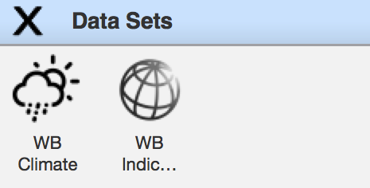

### Gradnik WB Indicators

`WB Indicators` je gradnik programa Orange za dostop do podatkov programskega vmesnika indikatorjev. Ta gradnik nam omogo“ca enastavno izbiro enega ali ve”c indikatorjev in ene ali ve“c dr”zav za katere “zelimo dobiti podatke izbranih indikatorjev. Za la”zje iskanje indikatorjev smo v grafi“cnem vmesniku dodali dve mo”znosti presejanja seznama indikatorjev. Pri prvem situ si lahko izberemo prikaz vseh indikatorjev, pogosto uporabljenih indikatorjev[19] ali pa izpostavljenih indikatorjev[20]. Drugo sit pa je tekstovno presejanje po poljih: koda “Id”, ime “Name”, teme “Topics” in viri “Sources”. V grafi“cnem vmesniku si lahko tudi izberemo eno izmed oblik izhodnih podatkov kot ”casovne vrste (*angl.* Time Series) ali podatke dr“zav (*angl.* Countries), kot smo ju opisali v razdelku \[razred\_indicatordatasets\]. Implementirali pa smo tudi prikaz napredka prenosa podatkov, s ”stevili vseh in "ze izvedenih poizveb, omenjeni v razdelku \[razered\_indicator\_api\].

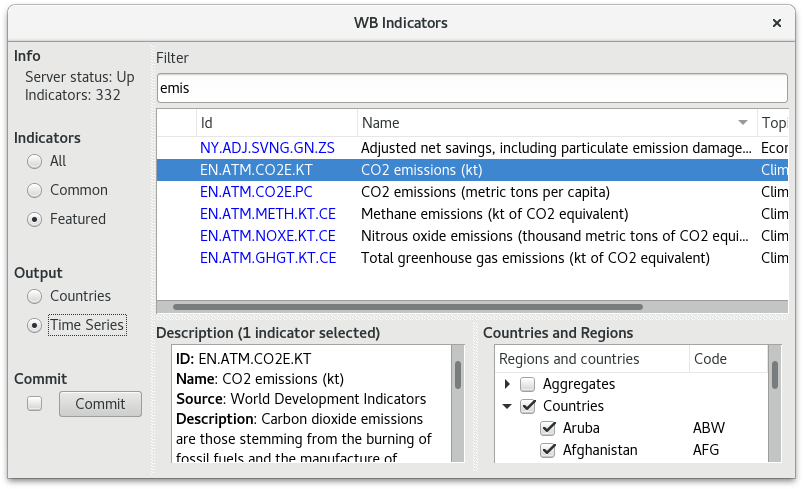

### Gradnik WB Climate

Gradnik za izbiro podnebnih podatkov podatkovnega vmesnika Svetovne banke, nam ponuja mo“znosti izbire dr”zav, vrste podatkov in vrste meritvenega obdobja. Prav tako kot gradnik WB Indicators, lahko tudi tukaj izberemo obliko izhodnih podatkov. Mo“zni izbiri oblike izhodnih podatkov sta ”casovne vrste in podatki dr“zav, kot smo opisani v poglavju \[razsiritev\_razreda\_climatedataset\]. Kot dodatno mo”znost pa imamo v tem grafi“cnem vmesniku tudi zastavico, ki dolo”ca ali bomo za dr“zave izpisovali imena ali pa kode. Tudi temu grafi”cnemu vmesniku smo dodali prikaz napredka prenosa podatkov.

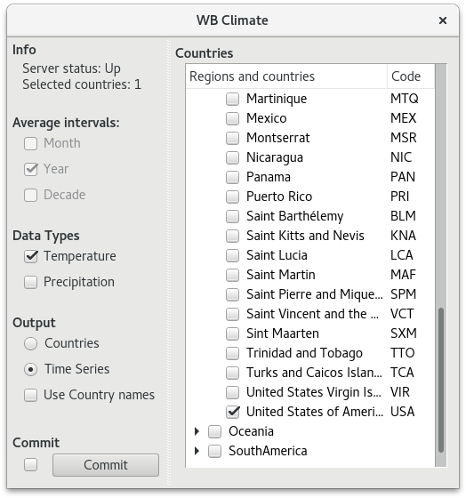

Primeri uporabe
===============

### Primer uporabe modula api\_wrapper

Enostaveno uporabo modula `api_wrapper` s skriptnim delom programa Orange prikazuje primer \[scripting\_example\]. V temu primeru pogledamo kako u“cinkovito lahko napovemo smrtnost otrok iz raznih indikatorjev zdravja in okolja in infrastrukture. V vrsticah 5 do 15 naredimo poizvedbe po potrebnih podatkih s programskega vmesnika Svetovne banke. Nato v vrsticah 18 do 27 odstranimo vrstice ki nimajo ciljne vrednosti in naredimo novo tabelo z razredom ki ga ”zelimo napovedovati. Vrednosti, ki jih “zelimo napovedovati se nahajajo v stolpcu 55 v tabeli `class_data`. Ta vrstica vsebuje podatke o smrtnosti otrok mlaj”sih od enega leta, za leto 2015. V naslednjih vrsticah pa zgradimo “stiri napovedne modele: naklju”cni gozd z regresijskimi drevesi, linearna regresija z regularizacijo in srednja vrednost. Za ocene napovednih modelov smo uporabili oceni *R**M**S**E*  [21] in *R*2  [22].

Napoved temperature s pomočjo CO2 emisij v ZDA
----------------------------------------------

Podatke svetovne banke lahko uporabimo tudi kot “casovne vrste, z uporabo posebnih gradnikov za delo s ”casovnimi vrstami . Tukaj si bomo ogledali enostaven primer napovedi temperature v ZDA s pomo“cjo podatkov o emisijah. V tej napovedi smo uporabili podatke tako z gradnika WB Indicators (Slika \[var\_indicator\_select\]) kot z gradnika WB Climate (Slika \[var\_climate\_select\]), kar prikazuje slika \[var\_setup\]. Podatke obeh gradnikov zdru”zimo v eno tablo Orange in s pom“cjo modela `var` napovemo podatke za povpre”cno letno temperaturo za naslednjih nekaj let\[var\_forecast\_graph\].

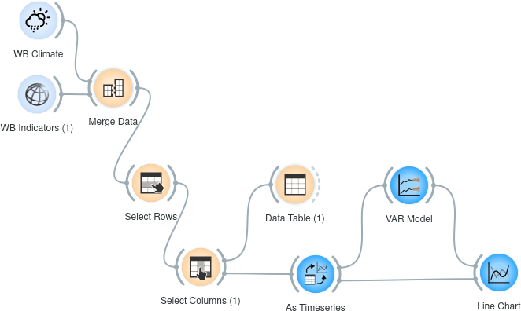

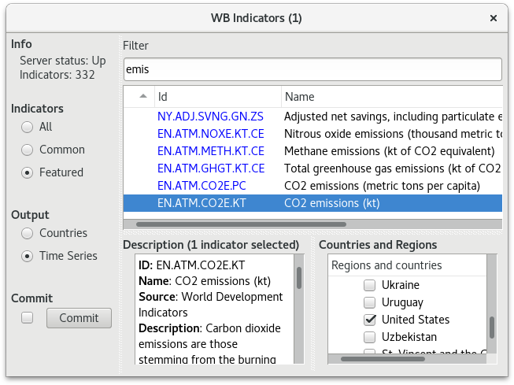

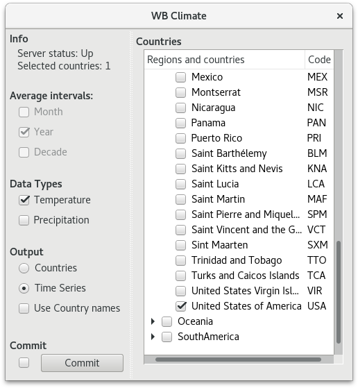

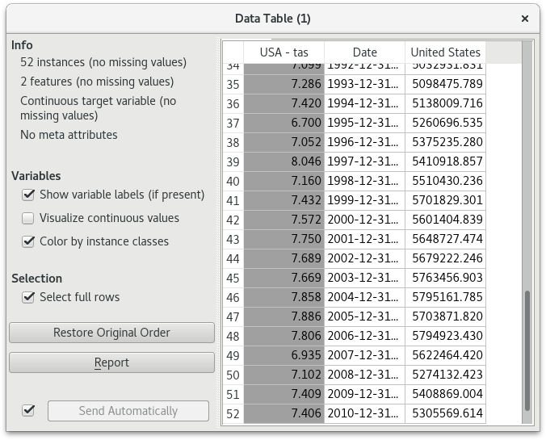

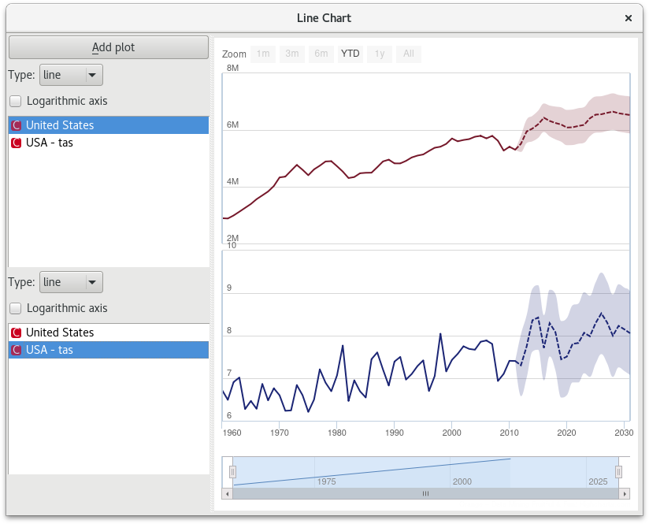

Clustering drzav 
-----------------

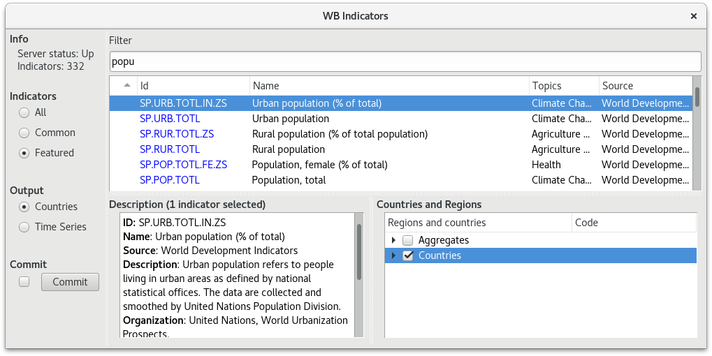

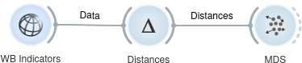

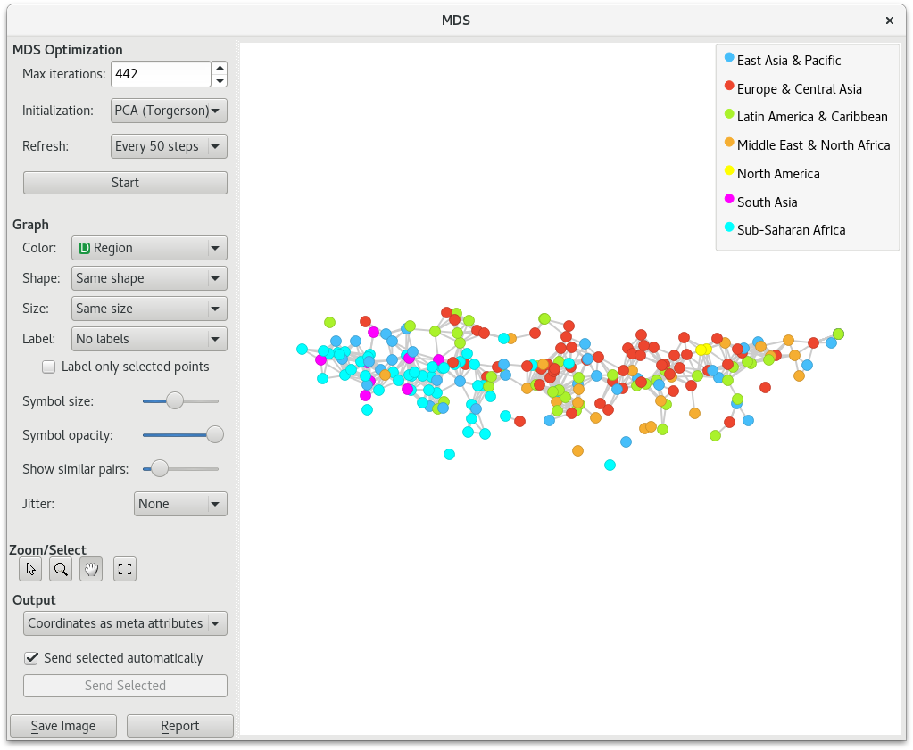

Sklepne ugotovitve
==================

Z izdelavo dodatka za program Orange smo zakljucili delo na diplomski nalogi. Vsa koda se nahaja na prosto dostopnem repozitoriju GIT na naslovih <https://github.com/zidarsk8/simple_wbd> in <https://github.com/zidarsk8/orange3-data-sets>.

S tem dodatkom smo olaj“sali dostop do podatkov programskega vmesnika Svetovne banke, tako v grafi”cnem vmesniku, kot v skriptnem delu programa Orange. Tako smo omogo“cili dostop do teh podatkov tudi ”sir“semu krogu ljudi. Poleg tega smo z na”sim vmesnikom tudi poenotili na“cin dostopo do podatkov Svetovne banke v programu Orange in s tem olaj”sali vzdr"zevanje in posodabljanje kode v primeru spremembe programskega vmesnika Svetovne banke.

Nas grafični dodatek za dostop do podatkov indikatorjev lahko nadgradimo tako, da uporabnikom grafičnega vmesnika omogočimo večjo izbiro oblik izhodnih podatkov in natančnejse presejanje rezultatov. Dodamo lahko tudi več metapodatkov na posamezne stolpce tabele Orange, ki nam omogočijo boljšo predstavnost v ostalih gradnikih Orange. V grafični vmesnik za dostop do podnebnih podatkov lahko dodamo še možnost izbire vodotočnih območji meritev. Za boljšo predstavo bi lahko postopek izbire drzav, regij in vodotočnih območij (Slika \[climate\_data\_api\_basins\]) omogočili preko interaktivnega zemljevida sveta.

1

World Development Indicators, The World Bank, (August 2016)
URL: <http://data.worldbank.org/data-catalog/world-development-indicators>

Data source: Global Financial Development Database (GFDD), The World Bank. Methodology citation: Martin Čihák, Aslı Demirgüç-Kunt, Erik Feyen, and Ross Levine, 2012. “Benchmarking Financial Systems Around the World.” World Bank Policy Research Working Paper 6175, World Bank, Washington, D.C. (Junij 2016)
<http://data.worldbank.org/data-catalog/global-financial-development>

Africa Development Indicators, The World Bank (Februar 2013)
<http://data.worldbank.org/data-catalog/africa-development-indicators>

Doing Business, The World Bank (http://www.doingbusiness.org) (Julij 2016)
<http://data.worldbank.org/data-catalog/doing-business-database>

Enterprise Surveys, The World Bank (Julij 2016)
<http://data.worldbank.org/data-catalog/enterprise-surveys>

Millennium Development Goals, The World Bank (Julij 2016)
<http://data.worldbank.org/data-catalog/millennium-development-indicators>

World Bank EdStats (Junij 2016)
<http://data.worldbank.org/data-catalog/ed-stats>

Gender Statistics, The World Bank (Julij 2016)
<http://data.worldbank.org/data-catalog/gender-statistics>

HealthStats, World Bank Group (Julij 2016)
<http://data.worldbank.org/data-catalog/health-nutrition-and-population-statistics>

IDA Results Measurement System, the World Bank (Julij 2016)
<http://data.worldbank.org/data-catalog/IDA-results-measurement>

Climatic Research Unit, University of East Anglia
<http://www.cru.uea.ac.uk/data>

Janez Demšar and Tomaž Curk and Aleš Erjavec and Črt Gorup and Tomaž Hočevar and Mitar Milutinovič and Martin Možina and Matija Polajnar and Marko Toplak and Anže Starič and Miha Štajdohar and Lan Umek and Lan Žagar and Jure Žbontar and Marinka Žitnik and Blaž Zupan, “Orange: Data Mining Toolbox in Python,” Journal of Machine Learning Research, vol. 14, pp. 2349-2353, 2013.

Jernej Kernc, “Orodje za interaktivno analizo časovnih vrst,” 2016

Jure Dimec (2002), Medjezično iskanje dokumentov
<http://clir.craynaud.com/clir/MEDJEZICNOISKANJEDOKUMENTOV.pdf>

[1] <http://apiv3.iucnredlist.org/api/v3/docs>

[2] <https://api.nasa.gov/>

[3] <https://www.goodreads.com/api>

[4] <http://climatedataapi.worldbank.org/>

[5] <http://api.worldbank.org/>

[6] <http://api.worldbank.org/sources?format=json>

[7] <http://api.worldbank.org/countries?format=json>

[8] <http://api.worldbank.org/incomeLevels?format=json>

[9] <http://api.worldbank.org/indicators?format=json>

[10] <http://api.worldbank.org/lendingTypes?format=json>

[11] <http://api.worldbank.org/topics>

[12] <https://pypi.python.org/pypi/simple_wbd/0.5.0>

[13] <https://pypi.python.org/pypi/Orange3-Datasets/0.1.3>

[14] <https://pypi.python.org/pypi/wbdata>

[15] <https://pypi.python.org/pypi/wbpy/2.0.1>

[16] <https://pypi.python.org/pypi/vcrpy/1.10.0>

[17] <https://pypi.python.org/pypi/requests-cache>

[18] Domena “Domain” je razred v orodju Orange, ki določa tipe in imena značilk in ciljnih razredov.

[19] Seznam je na voljo na strani <http://data.worldbank.org/indicator?tab=all>

[20] Seznam je na voljo na strani <http://data.worldbank.org/indicator?tab=featured>

[21] <https://en.wikipedia.org/wiki/Root-mean-square_deviation>

[22] <https://en.wikipedia.org/wiki/Coefficient_of_determination>
